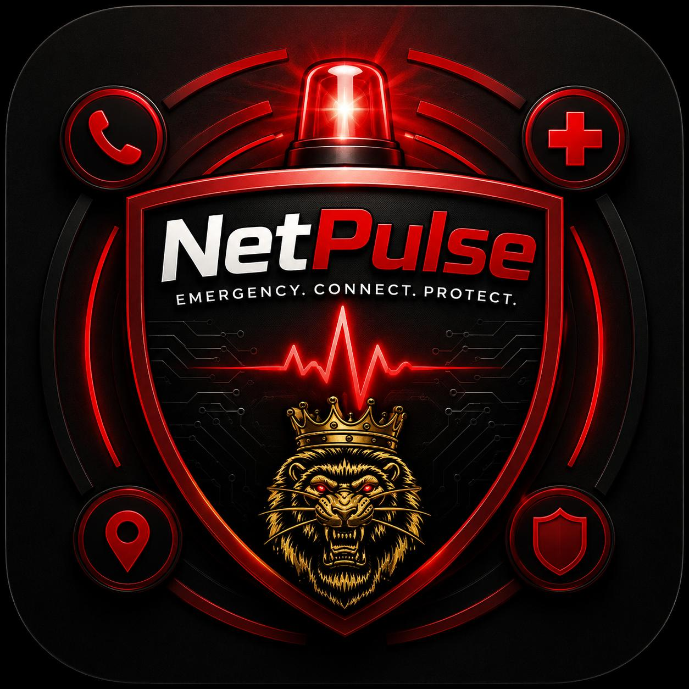

<div align="center">




<br/>

[](https://git.io/typing-svg)

<br/>


</div>

<br/>

> ⚠️ **A couple of the badges/lines above are placeholders, not claims.** The License badge says "Add one" because this repo doesn't currently have a `LICENSE` file even though earlier docs mentioned MIT — pick a real license and swap that badge out. The screenshots below are marked `TODO` for the same reason: I haven't generated real ones, and a README with fake screenshots is worse than one with none.

---

## 📖 Table of contents

- [What is PulseNet](#-what-is-pulsenet)
- [Screenshots](#-screenshots)
- [Feature status](#-feature-status)
- [Safety principles](#-safety-principles)
- [Tech stack](#-tech-stack)
- [Project structure](#-project-structure)
- [Getting started](#-getting-started)
- [Permissions](#-permissions)
- [Localization](#-localization)
- [Roadmap](#-roadmap)
- [Contributing](#-contributing)
- [Disclaimer](#-disclaimer)
- [License](#-license)

---

## 🚨 What is PulseNet

**PulseNet** is a Flutter personal-safety app built around South African emergency infrastructure — real numbers (10111, 10177, the GBV Command Centre), real SMS dispatch, and a safety-state machine (green / yellow / red, with a stealth mode) instead of a single panic button bolted onto a to-do app.

The core loop: tap the SOS button, a 5-second cancellable countdown runs, then a **real SMS** — not a push notification, not a toast that lies to you — goes out to your trusted contacts with your live location. Hold the button instead of tapping, and the same thing happens silently.

<div align="center">

</div>

---

## 📸 Screenshots

<!--
TODO: replace every cell below with a real screenshot or short screen-recording GIF
from a running build. Suggested path: docs/screenshots/<name>.png
-->

<div align="center">

| Dashboard | SOS countdown | Walk with me |
|:---:|:---:|:---:|
| `TODO: docs/screenshots/dashboard.png` | `TODO: docs/screenshots/sos.png` | `TODO: docs/screenshots/walk_with_me.png` |

| Safe places | Wearable | Danger snapshot |
|:---:|:---:|:---:|
| `TODO: docs/screenshots/safe_places.png` | `TODO: docs/screenshots/wearable.png` | `TODO: docs/screenshots/danger_snapshot.png` |

</div>

> Tip: record a 5–10s screen capture of the SOS countdown and convert it to a GIF (e.g. with `ffmpeg` or ScreenToGif) — an animated SOS flow sells this app far better than a static shot ever will.

---

## ✅ Feature status

Shipped means it's in `lib/` and wired into the app you'd actually install. Parked means the code exists in the repo but isn't compiled in — don't advertise these as working.

### Shipped

| Feature | What it actually does |
|---|---|
| 🆘 SOS + silent SOS | 5s cancellable countdown → real SMS with live location to trusted contacts |
| 🚦 Safety states | Green (normal) / Yellow (check-in) / Red (emergency), with a stealth mode |
| 🔑 Duress PIN | Looks like a normal unlock, silently triggers an alert |
| 🚶 Walk With Me | Timed companion mode; misses check-in → 60s grace → auto-SOS |
| 📍 Safe Places | Geofenced zones (home, work, etc.) with entry/exit awareness |
| 📞 Fake Call | Scheduled or instant fake call to exit a bad situation |
| 🩹 First Aid | Step-by-step offline emergency guidance |
| 👥 Trusted Contacts | Who receives alerts, managed on-device |
| 🎛️ Safety Profiles | Context presets — work, night out, travel |
| 🔒 App Lock | PIN/biometric lock, auto-relocks on background (never locks you out mid-emergency) |
| ⌚ Wearable heart rate | *(new)* Connects to any BLE Heart Rate Service device, live HR + battery |
| 📷 Danger Snapshot | *(new)* Native camera capture → instant SMS alert → share sheet to send the photo on |
| 🌍 Localization | Emergency phrases and first aid in English, Afrikaans, isiXhosa, isiZulu |
| 🕶️ Screenshot blocking | `FLAG_SECURE` on by default — your screen isn't in anyone's screenshot |

### Parked (in the repo, not compiled into the app)

| Feature | Why it's parked |
|---|---|
| 🚨 Danger Around Me | No verified crime/hazard data source wired in — currently a shell |
| 🚕 Taxi/ride safety | Not re-ported since the `parked/` split |
| 🏅 Safe Points (gamification) | Not re-ported; arguably doesn't belong in a crisis-first app anyway |
| 🫀 Camera-based pulse (finger on lens) | Works as a concept, not re-integrated |
| 🎙️ Distress-word listener, check-on-contact, journey share | Not re-ported since the `parked/` split |

There is **no CCTV/security-camera integration** in this app, shipped or parked — the closest thing historically was the finger-over-camera pulse reader above, which is unrelated to security cameras.

---

## 🧭 Safety principles

This project holds itself to explicit rules, not vibes:

1. **Correctness over speed** — accurate safety info beats a fast, wrong alert
2. **Privacy over data collection** — minimal data, local-first storage, explicit consent
3. **Fail-safe behavior** — default to the safe state under uncertainty
4. **Explicit consent** — all tracking/monitoring requires the user to opt in
5. **Verified information** — alerts come from verified sources where possible
6. **Security over shortcuts** — never trade security for convenience
7. **Transparency** — the app tells you plainly what it does and why

---

## 🛠️ Tech stack


- **State management:** Provider — a small composition root in `main.dart`, no widget-tree magic
- **Storage:** `SharedPreferences` for settings, `flutter_secure_storage` for contacts/medical/PIN data
- **Emergency dispatch:** a native Android `MethodChannel` (`MainActivity.kt`) sending real SMS via `SmsManager` — not a plugin, not a mock
- **Bluetooth:** `flutter_blue_plus` talking to the standard BLE Heart Rate (0x180D) and Battery (0x180F) GATT services
- **Camera:** `image_picker` launches the native camera for the danger-snapshot flow; sharing goes through `share_plus`

---

## 🗂️ Project structure

```text
lib/
├── main.dart                     # composition root — providers, app lock, duress PIN wiring
├── safety_state.dart             # green/yellow/red state machine
├── theme.dart                    # dark theme, color tokens
├── data/
│   └── sa_helplines.dart
├── services/
│   ├── sos_service.dart          # SMS dispatch, follow-ups, all-clear
│   ├── native_bridge.dart        # Android MethodChannel: SMS, call, FLAG_SECURE
│   ├── storage_service.dart      # prefs + secure storage
│   ├── audit_log_service.dart    # tamper-evident local audit trail
│   ├── bluetooth_wearable_service.dart   # heart rate + battery over BLE
│   ├── danger_snapshot_service.dart      # capture, geotag, alert, share
│   └── ...
└── screens/
    ├── dashboard_screen.dart
    ├── sos_confirmation_screen.dart
    ├── walk_with_me_screen.dart
    ├── safe_places_screen.dart
    ├── wearable_screen.dart
    ├── danger_snapshot_screen.dart
    └── ...

parked/                           # not compiled — see Feature status above
```

---

## 🚀 Getting started

### Prerequisites

- Flutter SDK 3.0.0+
- Dart SDK (bundled with Flutter)
- Android Studio (device/emulator + SDK tooling)
- A Google Maps API key (Safe Places uses `google_maps_flutter`)

### Install

```bash
git clone https://github.com/YOUR_USERNAME/pulsenet.git
cd pulsenet
flutter pub get
```

Add your Maps key to `android/local.properties`:

```properties
MAPS_API_KEY=your_key_here
```

Run it:

```bash
flutter run
```

<div align="center">

</div>

---

## 🔐 Permissions

| Permission | Used for |
|---|---|
| `SEND_SMS`, `CALL_PHONE` | SOS dispatch and one-tap emergency calling |
| `ACCESS_FINE_LOCATION`, `ACCESS_COARSE_LOCATION` | Location in alerts, Safe Places, BLE scan on Android < 12 |
| `RECORD_AUDIO` | Distress-word listener (parked) |
| `BLUETOOTH_SCAN`, `BLUETOOTH_CONNECT` | Wearable heart-rate pairing |
| `CAMERA` | Danger snapshot capture |
| `POST_NOTIFICATIONS`, `VIBRATE` | Local alerts and haptic feedback |

Every permission is requested at the point of use, never in bulk on first launch.

---

## 🌍 Localization

Emergency phrases and first-aid guidance ship in:

🇿🇦 English · Afrikaans · isiXhosa · isiZulu

(`assets/data/distress_phrases/`, `assets/data/first_aid/`)

---

## 🧩 Roadmap

- [ ] Pick and add a real `LICENSE` file
- [ ] Re-port Danger Around Me against a verified crime/hazard data source
- [ ] Decide whether abnormal wearable heart rate should trigger a check-in prompt
- [ ] Look into a published police tip-line (SAPS or provincial) to target from the danger-snapshot share sheet
- [ ] Real screenshots/GIFs in `docs/screenshots/`
- [ ] iOS build validation (native bridge is currently Android-only)

---

## 🤝 Contributing

Contributions are welcome if they hold the line on the safety principles above:

1. New features must have a clear safety rationale, not just a cool factor
2. Privacy implications get called out in the PR description
3. Anything touching SOS dispatch, location, or the safety-state machine needs a plain-English explanation of the failure modes
4. Test on a real device where possible — emulator SMS/Bluetooth behavior lies to you

---

## ⚠️ Disclaimer

PulseNet is designed to assist with personal safety. It is **not** a replacement for calling emergency services directly, and it should not be treated as the sole layer of protection in a dangerous situation.

---

## 📄 License

_No `LICENSE` file exists in this repo yet — add one (MIT is a reasonable default for an open-source safety tool) before calling this "open source."_

<br/>

<div align="center">

</div>
